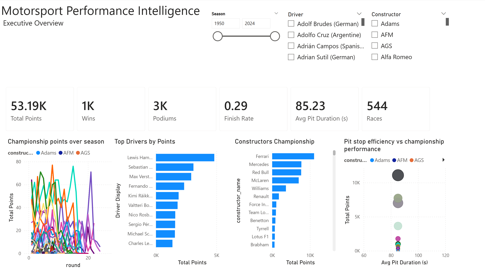
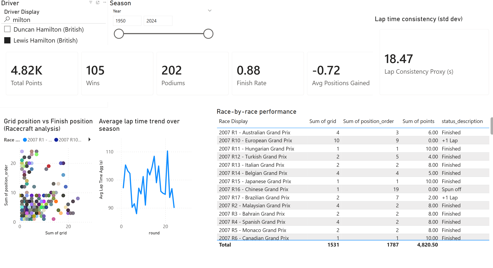
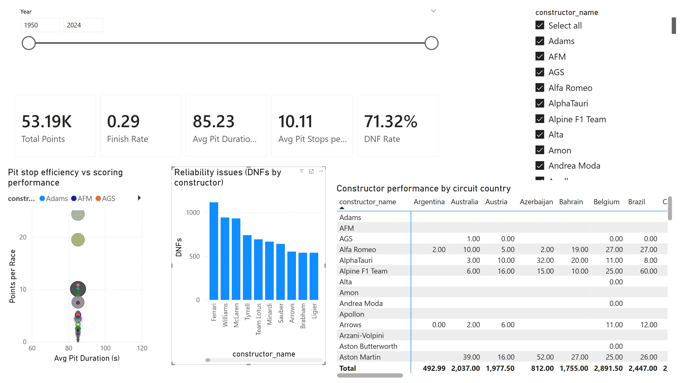
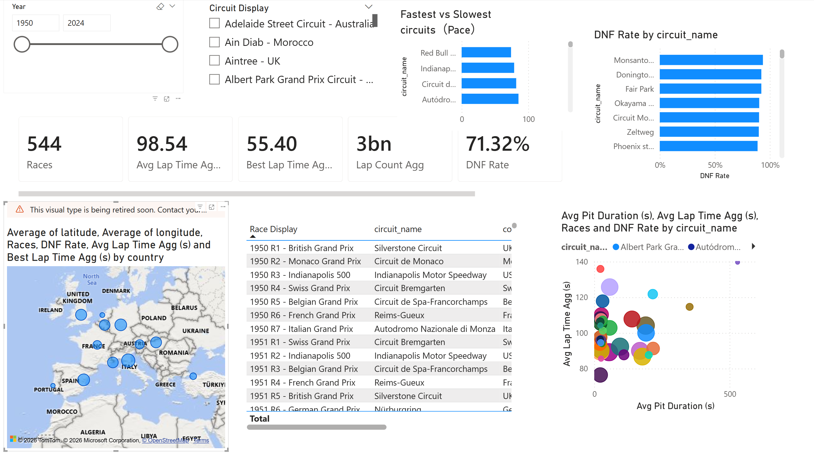
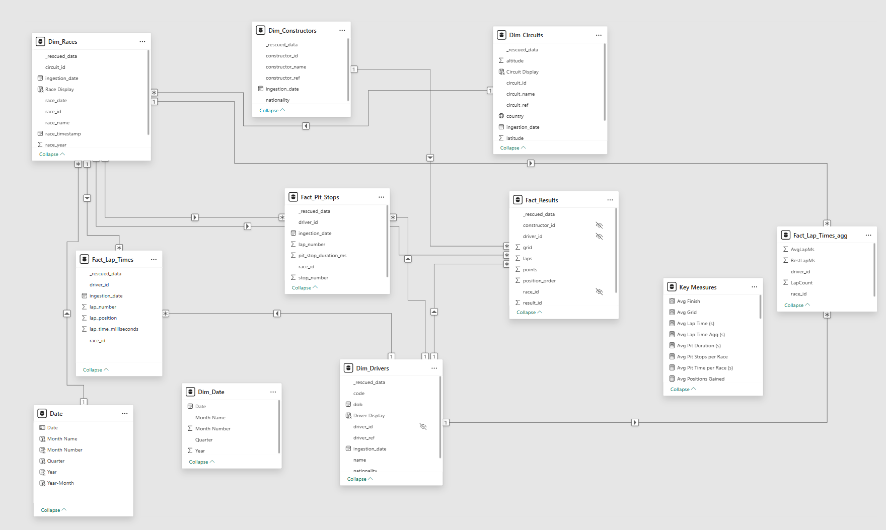

# F1 Data Analytics Project: From Ingestion to Intelligence

This project is an end-to-end data analytics solution that processes historical Formula 1 data (1950–2024) to generate actionable performance insights. It leverages Databricks for a scalable ETL pipeline (following the Medallion Architecture) and Power BI for advanced visualization and analytics.


## System Context

```
Kaggle API
   ↓
Databricks (Bronze → Silver → Gold, Delta Lake, Unity Catalog)
   ↓
Power BI Semantic Model (Star Schema)
   ↓
Incremental Refresh + Aggregation Tables
   ↓
Interactive Dashboards & Drill‑through Analytics
```

---

## Architecture Overview

The solution follows a modern data engineering workflow: Data Source: Formula 1 World Championship data fetched dynamically from Kaggle via API. Data Lakehouse (Databricks): Bronze Layer: Raw data ingestion into Delta Lake. Silver Layer: Data cleaning, schema enforcement, and standardization. Gold Layer: Business-level aggregations and star-schema modeling. Analytics Layer (Power BI): Interactive dashboard connecting to the Gold layer for "Performance Intelligence."

The data engineering pipeline is built using PySpark on Databricks, utilizing Unity Catalog for governance and Delta Lake for storage reliability.

---

# Data Ingestion (Bronze Layer)

Automated Extraction: Utilizes kagglehub to download the latest F1 dataset directly into Databricks Unity Catalog Volumes, bypassing local driver storage for security and scalability. Raw Storage: Reads 14+ CSV files (Circuits, Races, Drivers, Constructors, Lap Times, etc.) and ingests them into Managed Delta Tables. Metadata Management: All raw tables are cataloged under the Bronze schema in Unity Catalog.

# Data Transformation (Silver Layer)

Handling \N values as standard NULL. Dropping irrelevant URL columns to optimize storage. Standardizing column names (Snake case, removing spaces). Schema Enforcement: Explicitly casting columns to correct data types (Integer, Double, Date, Timestamp) to ensure data quality. Date Engineering: Transformation of string dates into timestamp objects for time-series analysis.

# Business Logic & Aggregation (Gold Layer)

Star Schema Preparation: Joining normalized tables (e.g., Races + Circuits, Drivers + Results) to create rich dimension and fact tables.

---

### Power BI Dashboard 


## Data Model (Semantic Layer)

The Power BI model follows a star schema optimized for analytical workloads.

### Dimensions

* Dim_Races
* Dim_Drivers
* Dim_Constructors
* Dim_Circuits
* Date

### Fact Tables

* **Fact_Results** – race outcomes and championship points
* **Fact_Pit_Stops** – pit stop operations
* **Fact_Lap_Times** – lap‑level telemetry (incremental refresh enabled)
* **Fact_Lap_Agg** – aggregated lap statistics (race × driver grain)

### Semantic Enhancements

Business‑friendly display fields are implemented for slicers and tooltips:

* Driver Display → `Name (Nationality)`
* Race Display → `Year + Round + Race Name`
* Circuit Display → `Circuit Name – Country`

---

## Engineering Features

### Incremental Refresh

Applied to high‑volume fact tables:

* Fact_Lap_Times
* Fact_Pit_Stops

Configuration:

* Archive window: **3 years**
* Refresh window: **last 7 days**

This enables scalable refresh performance while preserving long‑term historical data.

### Aggregation Table (Fact_Lap_Agg)

Lap‑level data (~580k rows) is reduced to race‑driver aggregates (~11k rows):

* Average lap time
* Best lap time
* Lap count

This table powers most pace and consistency visuals, significantly improving interactivity and query performance.

### Measure Layer

All business logic is centralized in a dedicated measures table, including:

* Championship metrics: points, wins, podiums, top‑10 finishes
* Reliability metrics: DNF rate, finish rate
* Operational metrics: average pit duration, pit stops per race
* Pace metrics: average and best lap times

---

### 1. Executive Overview

High‑level season summary combining sporting results and operational efficiency.

**Key visuals:**

* KPI cards (points, wins, podiums, finish rate, pit duration, races)
* Championship trend by round
* Top drivers and constructors ranking
* Pit stop efficiency vs championship performance scatter plot

**Purpose:** explain *who dominates the season and why*.



---

### 2. Driver Performance Deep Dive

Driver‑centric diagnostics of racecraft, consistency, and pace.

**Key visuals:**

* Driver KPI profile
* Grid vs finish position scatter (racecraft analysis)
* Average lap time trend across rounds
* Lap consistency proxy (standard deviation)
* Race‑by‑race performance table

**Purpose:** decompose driver performance beyond total points.



---

### 3. Constructor & Strategy

Team‑level operational efficiency and reliability analysis.

**Key visuals:**

* Constructor KPI cards
* Pit duration vs points per race scatter
* DNFs by constructor
* Performance matrix by circuit country

**Purpose:** evaluate how strategy execution and reliability affect championship outcomes.



---

### 4. Race & Circuit Intelligence

Circuit‑level pace and risk profiling.

**Key visuals:**

* Circuit KPI cards (pace, best lap, lap volume, DNF rate)
* DNF rate ranking by circuit
* Fastest circuits by average lap time
* Pit duration vs circuit pace scatter

**Purpose:** identify high‑risk and high‑sensitivity circuits for strategic planning.



---

### 5. Model View (Star Schema)

A view of the Power BI semantic model showing the star schema relationships between dimensions and fact tables.

**Purpose:** demonstrate a production-style semantic layer with clear filtering paths and reusable measures.



---

### Drill-through: Race Detail (Lap-by-Lap)

Interactive diagnostic workflow accessible via right-click drill-through from any aggregated view.

**Key visuals:**

* Lap-by-lap pace evolution line chart
* Pit stop details table

**Purpose:** connect executive-level KPIs to telemetry-level root cause analysis.

---

## Skills Demonstrated

* Data warehouse modeling (Medallion architecture, star schema)
* Power Query engineering
* Incremental refresh design
* Aggregation table strategy
* Advanced DAX measure development
* Performance‑oriented BI modeling
* Analytical UX design (cross‑filtering, drill‑through, tooltips)

---

## File

* `motorsport_performance_intelligence.pbix`

---

## License & Data Source

The dataset is based on publicly available Formula 1 historical data retrieved via the Kaggle API and is used strictly for educational and analytical purposes.

---

https://www.kaggle.com/datasets/rohanrao/formula-1-world-championship-1950-2020
